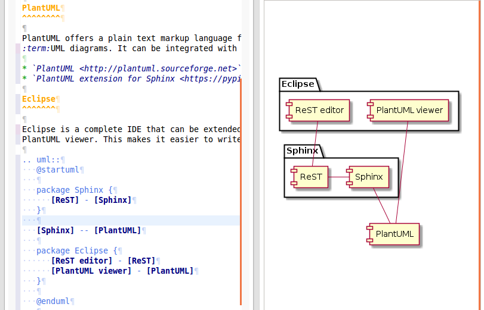

Colophon
========

Tools used for this documentation
---------------------------------

Sphinx
^^^^^^

Sphinx can generate documentation in various formats, and include code samples,
references, diagrams and more. The source of the documentation is written
with reStructuredText markup.

* `Sphinx documentation <http://sphinx-doc.org/contents.html>`_
* `reStructuredText <http://docutils.sourceforge.net/docs/ref/rst/directives.html>`_

PlantUML
^^^^^^^^

PlantUML offers a plain text markup language for various types of 
:term:UML diagrams. It can be integrated with Sphinx.

* `PlantUML <http://plantuml.sourceforge.net>`_
* `PlantUML extension for Sphinx <https://pypi.python.org/pypi/sphinxcontrib-plantuml>`_

Eclipse
^^^^^^^

Eclipse is a complete IDE that can be extended with both a ReST editor and a
PlantUML viewer. This makes it easier to write documentation and UML diagrams,
by having the source and the rendered diagram side by side.

   
   Screenshot of editing in Eclipse with live UML preview
   
.. note::
   You don't need the `@startuml` and `@enduml` tags in the `.. uml::` section 
   for Sphinx, but they are needed for the live preview view in Eclipse.
   
* `Eclipse <http://www.eclipse.org>`_
* `ReST editor plugin <http://marketplace.eclipse.org/content/rest-editor>`_
* `PlantUML plugin <http://marketplace.eclipse.org/content/plantuml>`_